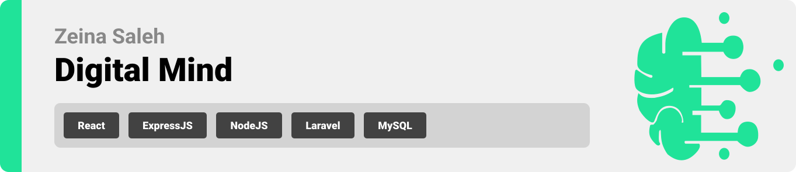

> Hello world! This is the project’s summary that describes the project plain and simple, limited to the space available. 


**[PROJECT PHILOSOPHY](https://github.com/hassankhalil33/ucard#project-philosophy) • [PROTOTYPES](https://github.com/hassankhalil33/ucard#wireframes) • [TECH STACK](https://github.com/hassankhalil33/ucard#tech-stack) • [IMPLEMENTATION](https://github.com/hassankhalil33/ucard#impplementation) • [HOW TO RUN?](https://github.com/hassankhalil33/ucard#how-to-run)**

  

> Digital Mind allows you to create beautiful mind maps by uploading links, images or pdf of your ideas or simply writing text. 
> 
> Had a vision for a brilliant idea? Don't let it slip! Gather your thoughts and improve on it with a mind map.
> 
### User Stories
- As a user, I want to create mind maps by adding resources, connecting them visually, and arranging ideas so that I can structure my thoughts 
- As a user, I want to be able to discuss and share ideas with others so that I can find people with similar interests as me
- As a user, I want to schedule meetings with team members, so that we can discuss project ideas
- As a user, I want to create group discussions so we can plan our next step
- As a user, I want to be able to view others mind maps so I can get inspired
- As a user, I want to view a time schedule of all my meetings and upcoming events so that I can stay on track

  

> This design was created on Figma app. I used tailwind framework during implementation and was able to replicate the figma design acurately

### Landing Page
| Landing                                               |
|-------------------------------------------------------|
| 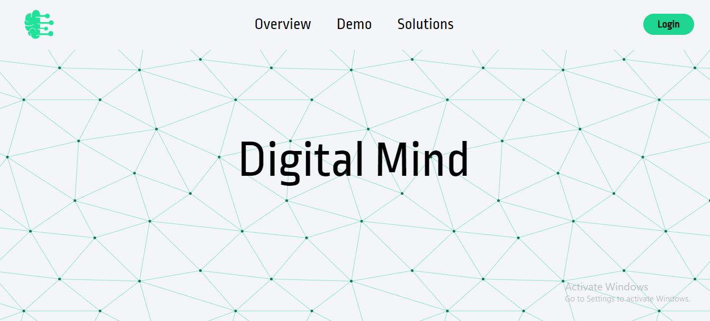 |

| Overview                                              |
|-------------------------------------------------------|
| 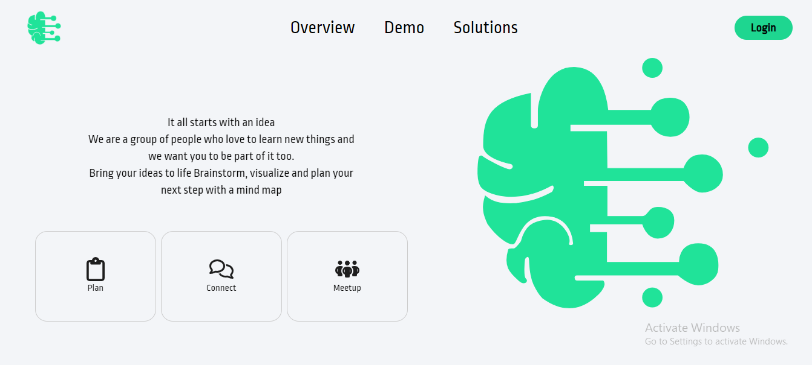 |

### Login / Signup
| Login                                                            | SignUp                                                            |
|------------------------------------------------------------------|-------------------------------------------------------------------|
|  | 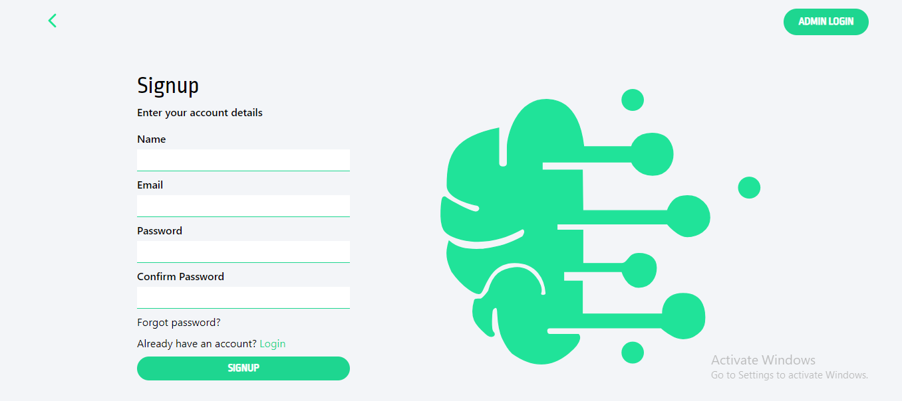 |

### Platform
| Explore Tab                                                      | Single View                                                       |
|------------------------------------------------------------------|-------------------------------------------------------------------|
| 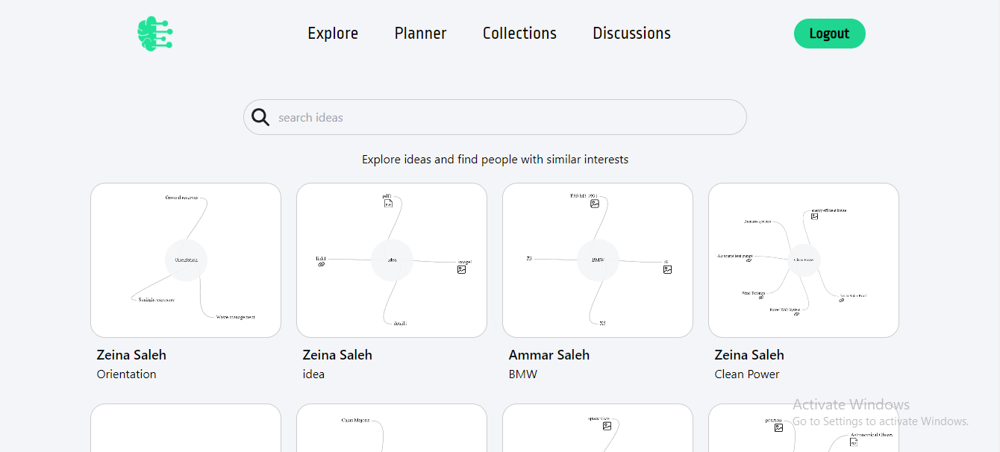 | 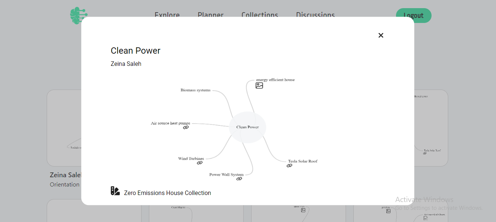 |

### Collections Tab
| Collapsed                                                        | Expanded                                                          |
|------------------------------------------------------------------|-------------------------------------------------------------------|
| 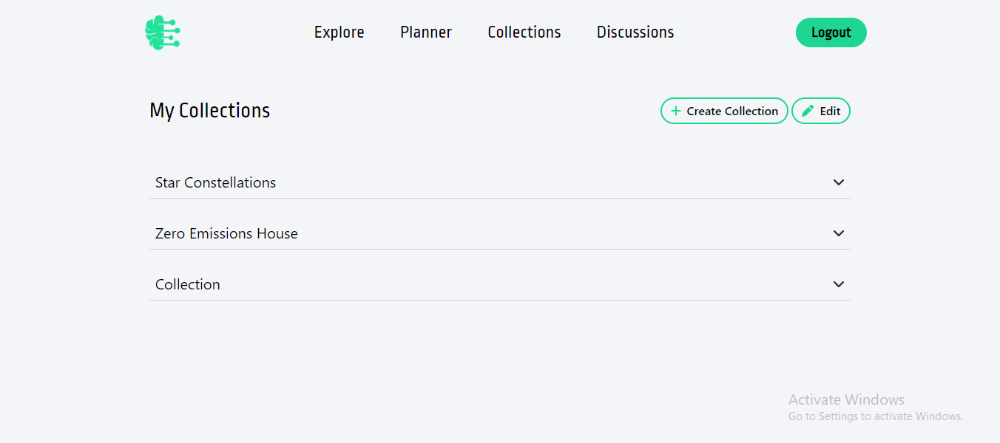 | 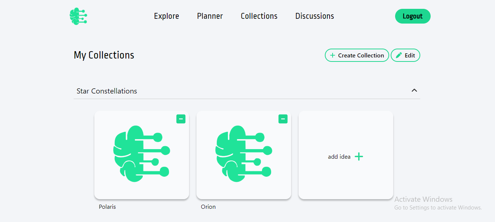 |
 
| Edit Mode                                                        | CRUD Modal                                                        |
|------------------------------------------------------------------|-------------------------------------------------------------------|
| 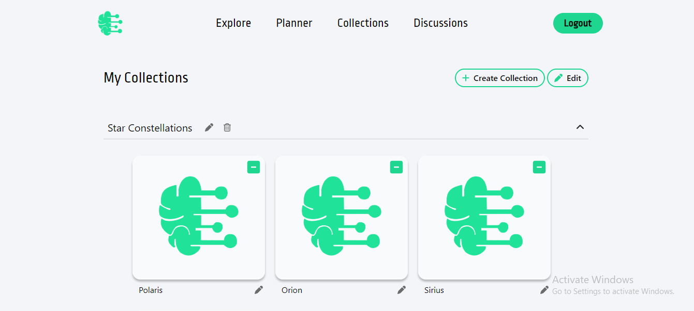 | 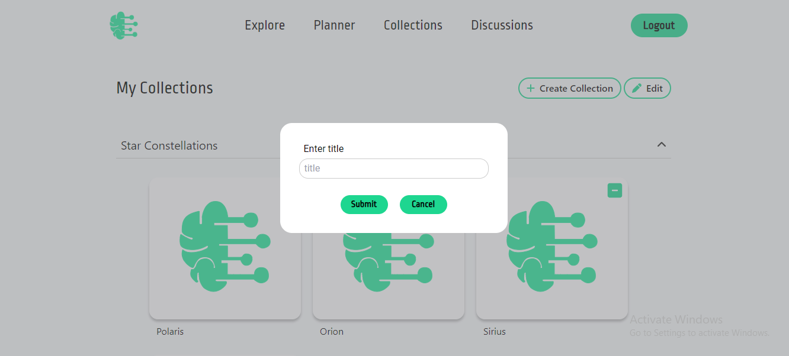 |

### Mind Map View
| Map                                                              | Resources Modal                                                   |
|------------------------------------------------------------------|-------------------------------------------------------------------|
| 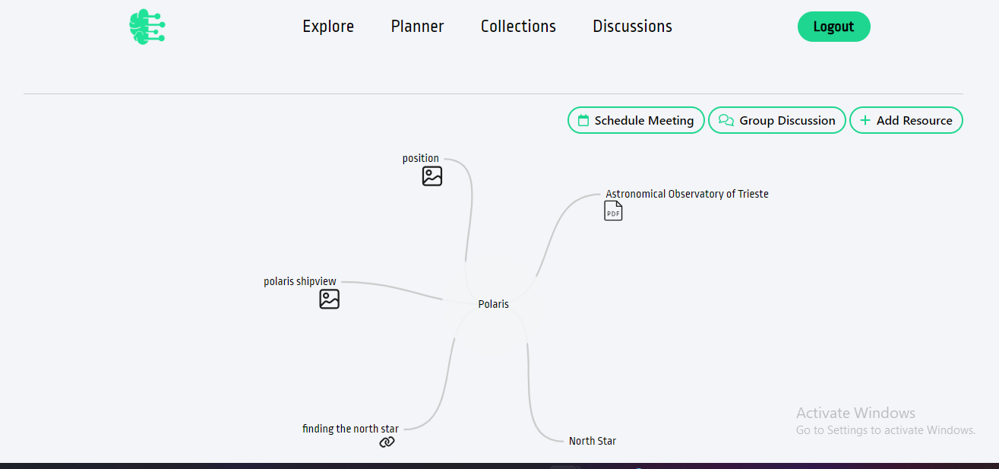 | 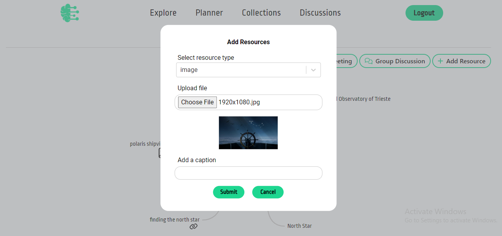 |

### Discussions Tab
| Discussions                                                      | Chat Box                                                          |
|------------------------------------------------------------------|-------------------------------------------------------------------|
| 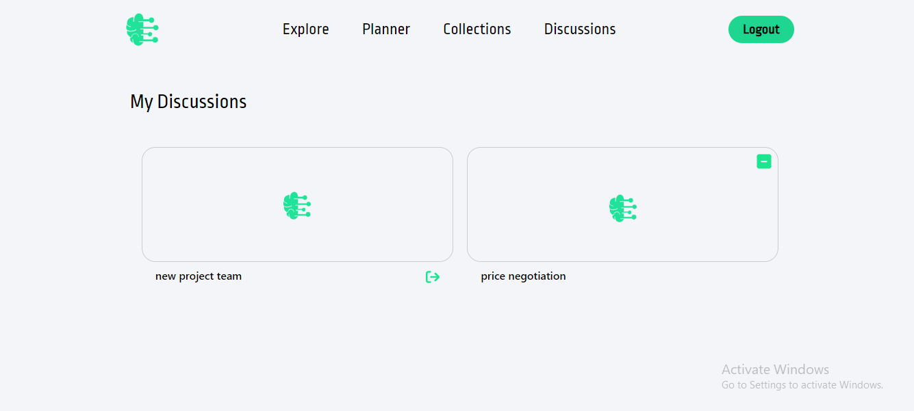 | 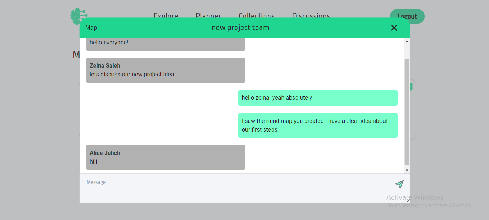 |

  
