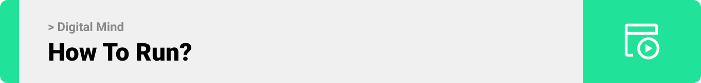

<div align="center">

> Hello world! This is the project’s summary that describes the project plain and simple, limited to the space available. 
 


**[PROJECT PHILOSOPHY](https://github.com/hassankhalil33/ucard#project-philosophy) • [PROTOTYPES](https://github.com/hassankhalil33/ucard#wireframes) • [TECH STACK](https://github.com/hassankhalil33/ucard#tech-stack) • [IMPLEMENTATION](https://github.com/hassankhalil33/ucard#impplementation) • [HOW TO RUN?](https://github.com/hassankhalil33/ucard#how-to-run)**

</div>

<br><br>


> Digital Mind allows you to create beautiful mind maps by uploading links, images or pdf of your ideas or simply writing text. 
> 
> Had a vision for a brilliant idea? Don't let it slip! Gather your thoughts and improve on it with a mind map.
> 
### User Stories
- As a user, I want to create mind maps by adding resources, connecting them visually, and arranging ideas so that I can structure my thoughts 
- As a user, I want to be able to discuss and share ideas with others so that I can find people with similar interests as me
- As a user, I want to schedule meetings with team members, so that we can discuss project ideas
- As a user, I want to create group discussions so we can plan our next step
- As a user, I want to be able to view others mind maps so I can get inspired
- As a user, I want to view a time schedule of all my meetings and upcoming events so that I can stay on track

<br><br>


> This design was created on Figma app. I used tailwind framework during implementation and was able to replicate the figma design acurately

### Landing Page
| Landing                                               |
|-------------------------------------------------------|
|  |


| Overview                                              |
|-------------------------------------------------------|
|  |

### Login / Signup
| Login                                                            | SignUp                                                            |
|------------------------------------------------------------------|-------------------------------------------------------------------|
|  |  |

### Platform
| Explore Tab                                                      | Single View                                                       |
|------------------------------------------------------------------|-------------------------------------------------------------------|
|  |  |

### Collections Tab
| Collapsed                                                        | Expanded                                                          |
|------------------------------------------------------------------|-------------------------------------------------------------------|
|  |  |
 
| Edit Mode                                                        | CRUD Modal                                                        |
|------------------------------------------------------------------|-------------------------------------------------------------------|
|  |  |

### Mind Map View
| Map                                                              | Resources Modal                                                   |
|------------------------------------------------------------------|-------------------------------------------------------------------|
|  |  |

### Discussions Tab
| Discussions                                                      | Chat Box                                                          |
|------------------------------------------------------------------|-------------------------------------------------------------------|
|  |  |

### Planner Tab
| Schedule                                                         | Event Modal                                                       |
|------------------------------------------------------------------|-------------------------------------------------------------------|
|  |  |

<br><br>


Here's a brief high-level overview of the tech stack the Ucard app uses:

- This project uses [React](https://react.dev/) for the Frontend. React lets you build user interfaces out of individual pieces called components. Then combine them into entire screens, pages, and apps.
- This project uses [Laravel]() for the User type backend. Laravel is a web application framework with expressive, elegant syntax. Laravel can serve as a robust backend API for your web or mobile app. 
- This project uses [ExpressJS](https://expressjs.com/) for the Admin type Backend. Fast, unopinionated, minimalist web framework for [NodeJS](https://nodejs.org/en/).
- For persistent storage (database), the app uses the [MySQL](https://www.mysql.com/). The world's most popular open source database.
- To send push notifications, the app uses [FireBase FCM](https://firebase.google.com/docs/cloud-messaging) package which server-to-server communication.


<br><br>


> Using the above mentioned tech stacks and the wireframes built with figma from the user stories we have, the implementation of the app is shown below, these are screenshots/gifs from the real app.
<br><br>



> This is an example of how you may give instructions on setting up your project locally.
To get a local copy up and running follow these simple example steps.

### Prerequisites

This is an example of how to list things you need to use the software and how to install them.
* npm
  ```sh
  npm install npm@latest -g
  ```

### Installation

_Below is an example of how you can instruct your audience on installing and setting up your app. This template doesn't rely on any external dependencies or services._

~~ Frontend:
1. Clone the repo
   ```sh
   git clone https://github.com/hassankhalil33/ucard.git
   ```
2. Navigate to the frontend folder
   ```sh
   cd frontend/
   ```
3. Install NPM packages
   ```sh
   npm install
   ```
   🚨 you might need to run `npm install --force`  if you face any dependency conflicts.
4. Install Expo CLI
   ```sh
   npm install --global expo-cli
   ```
5. Rename `.env.example` to `.env` then set your credentials.
6. Install Expo Go app for Android (Optional)
   > [Android Play Store](https://play.google.com/store/apps/details?id=host.exp.exponent)
7. Run the Start-Up Command
   ```sh
   npx expo start -c
   ```
8. Scan the QR Code with Expo Go App.
    -or-
   Press 'a' to run locally on Android Emulator (Requires an Active Android Emulator [Android Studio](https://developer.android.com/studio/install)).
   
~~ Backend:
1. Navigate to the backend folder (from root folder)
   ```sh
   cd backend/
   ```
2. Install NPM packages
   ```sh
   npm install
   ```
3. Rename `.env.example` to `.env` then set your credentials.
4. Run the Start-Up Command
   ```sh
   npm start
   ```
