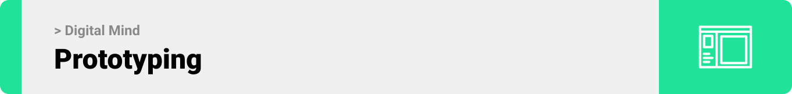
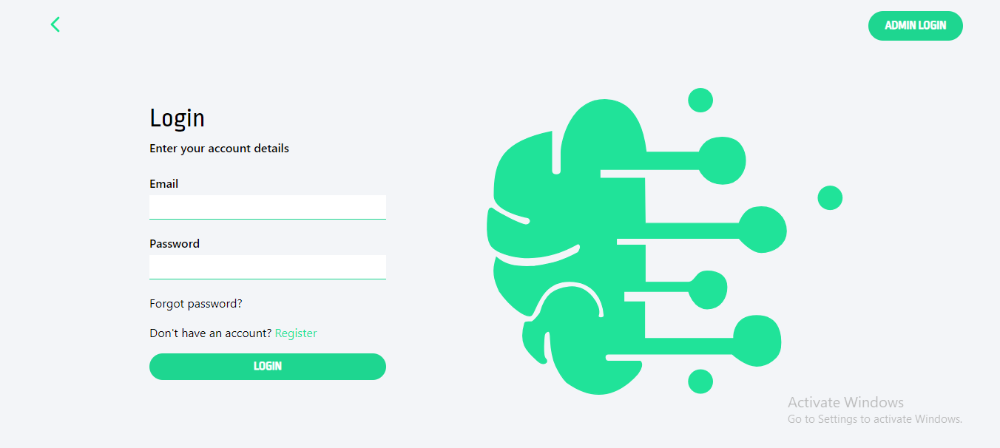
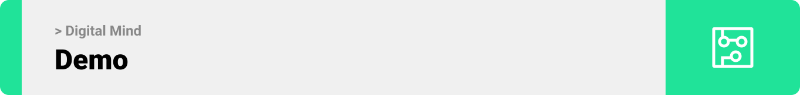
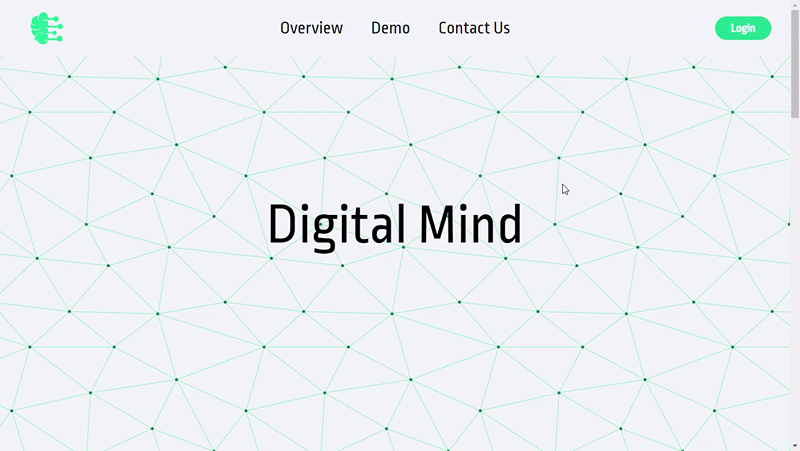
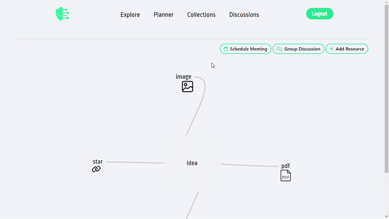

<div align="center">

> Hello world! This is the project’s summary that describes the project plain and simple, limited to the space available. 
 


**[PROJECT PHILOSOPHY](https://github.com/zeina-saleh/digital-mind-client#project-philosophy) • [PROTOTYPES](https://github.com/zeina-saleh/digital-mind-client#wireframes) • [TECH STACK](https://github.com/zeina-saleh/digital-mind-client#tech-stack) • [IMPLEMENTATION](https://github.com/zeina-saleh/digital-mind-client#implementation) • [HOW TO RUN?](https://github.com/zeina-saleh/digital-mind-client#how-to-run)**

</div>

<br><br>


> Digital Mind allows you to create beautiful mind maps by uploading links, images or pdf of your ideas or simply writing text. 
> 
> Had a vision for a brilliant idea? Don't let it slip! Gather your thoughts and improve on it with a mind map.


<span style="font-size: 22px;">User Stories</span>
- As a user, I want to create mind maps by adding resources, connecting them visually, and arranging ideas so that I can structure my thoughts 
- As a user, I want to be able to discuss and share ideas with others so that I can find people with similar interests as me
- As a user, I want to schedule meetings with team members, so that we can discuss project ideas
- As a user, I want to create group discussions so we can plan our next step
- As a user, I want to be able to view others mind maps so I can get inspired
- As a user, I want to view a time schedule of all my meetings and upcoming events so that I can stay on track
<br>

<span style="font-size: 22px;">Admin Stories</span>
- As an admin I want to view a dashboard where I can have full control over my website's user so that I can add, edit and remove users
<br>
- As an admin I want to have control over discussions created so that I can remove irrelevant discussions from the platfrom

<br><br>



> This design was created on Figma app. I used tailwind framework during implementation and was able to replicate the figma design acurately

| Landing                                               |
|-------------------------------------------------------|
|  |


| Overview                                              |
|-------------------------------------------------------|
|  |

| Login                                                            | SignUp                                                            |
|------------------------------------------------------------------|-------------------------------------------------------------------|
|  |  |

| Explore Tab                                                      | Single View                                                       |
|------------------------------------------------------------------|-------------------------------------------------------------------|
|  |  |

| Collapsed                                                        | Expanded                                                          |
|------------------------------------------------------------------|-------------------------------------------------------------------|
|  |  |
 
| Edit Mode                                                        | CRUD Modal                                                        |
|------------------------------------------------------------------|-------------------------------------------------------------------|
|  |  |

| Map                                                              | Resources Modal                                                   |
|------------------------------------------------------------------|-------------------------------------------------------------------|
|  |  |

| Discussions                                                      | Chat Box                                                          |
|------------------------------------------------------------------|-------------------------------------------------------------------|
|  |  |

<br><br>


Here's a brief high-level overview of the tech stack the Ucard app uses:

- This project uses [React](https://react.dev/) for the Frontend. React lets you build user interfaces out of individual pieces called components. Then combine them into entire screens, pages, and apps.
- This project uses [Laravel]() for the User type backend. Laravel is a web application framework with expressive, elegant syntax. Laravel can serve as a robust backend API for your web or mobile app. 
- This project uses [ExpressJS](https://expressjs.com/) for the Admin type Backend. Fast, unopinionated, minimalist web framework for [NodeJS](https://nodejs.org/en/).
- For persistent storage (database), the app uses the [MySQL](https://www.mysql.com/). The world's most popular open source database.
- To send push notifications, the app uses [FireBase FCM](https://firebase.google.com/docs/cloud-messaging) package which server-to-server communication.


<br><br>

<br><br>

| Landing                                               |
|-------------------------------------------------------|
|  |


| Login                                                 |
|-------------------------------------------------------|
|  |

| Explore                                               |
|-------------------------------------------------------|
|  |

| Collections                                           |
|-------------------------------------------------------|
|  |

| Map                                                   |
|-------------------------------------------------------|
|  |

| Meetings & Discussions                                |
|-------------------------------------------------------|
|  |

| Planner                                               |
|-------------------------------------------------------|
|  |

| Discussions                                           |
|-------------------------------------------------------|
|   |

| Admin Panel                                           |
|-------------------------------------------------------|
|   |


> Using the above mentioned tech stacks and the wireframes built with figma from the user stories we have, the implementation of the app is shown below, these are screenshots/gifs from the real app.
<br><br>


> These are guidlines for setting up digital mind locally.
To get a local copy up and running follow these simple example steps.

<span style="font-size: 22px;">Prerequisites</span>

This is a list of the dependencies you need to install on your OS to run Digital Mind.
* Download and Install Node.js 
  ```sh
  (https://nodejs.org/en)
  ```
* Download and Install Postman 
  ```sh
  (https://www.postman.com/downloads/))
  ```
* Download and Install XAMPP 
  ```sh
  (https://www.apachefriends.org/)
  ```

<span style="font-size: 22px;">Installation</span>

~~ Frontend:
1. Clone the repo
   ```sh
   git clone https://github.com/zeina-saleh/digital-mind-client
   ```
2. Navigate to the client folder
   ```sh
   cd client
   ```
3. Install NPM packages
   ```sh
   npm install
   ```
4. Run the Start-Up Command
   ```sh
   npm run start
   ```
   
~~ Backend:
1. Clone the repo
   ```sh
   git clone https://github.com/zeina-saleh/digital-mind-server
   ```
2. Install composer packages
   ```sh
   composer install
   ```
3. Rename `.env.example` to `.env` then set your credentials.
4. Run the Start-Up Command
   ```sh
   php artisan serve
   ```
5. Open XAMPP panel
6. Start Apache and MySQL servers
   🚨 To access your db press on admin button next to MySQL server

~~ Admin Panel:
1. Clone the repo
   ```sh
   git clone https://github.com/zeina-saleh/digital-mind-admin-backend
   ```
2. Install NPM packages
   ```sh
   npm install
   ```
3. Install Nodemon Server NPM package (optional)
   ```sh
   npm install -g nodemon 
   ```
4. Run the Start-Up Command
   ```sh
   nodemon index.js
   ```
5. Aternatively startup default node server
   ```sh
   node index.js
   ```
6. Use postman to register an admin user
7. Navigate to the admin login page and login in
